<p align="center">
  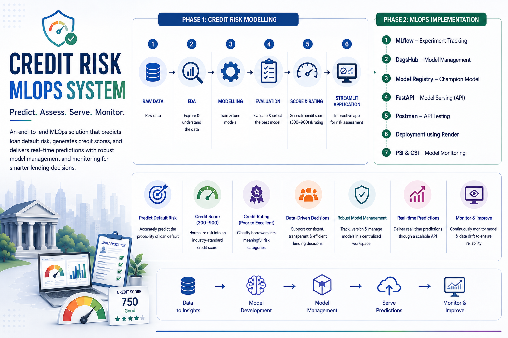
</p>

# Credit Risk MLOps System
An end-to-end **Credit Risk MLOps System** for Lauki Finance that combines machine learning-based loan default prediction with credit scoring, interactive risk assessment, experiment tracking, model management, API-based model serving, cloud deployment, and model monitoring.


---

### Live Application

> **FastAPI Model-Serving Application:** The application is hosted on Render's **Free instance** and it may take approximately one minute to respond to the first request after a period of inactivity.

**[Open the Deployed FastAPI Application](YOUR_RENDER_URL)**

---

## 1. Project Overview

The **Credit Risk MLOps System** is an end-to-end machine learning and MLOps solution developed to predict loan default risk and operationalize the credit risk model in a production-oriented environment.

The project consists of two phases:

- **Phase 1 – Credit Risk Model Development:** Developed and evaluated multiple classification models, ultimately selecting an **Optuna-optimized Logistic Regression with SMOTE-Tomek** as the final credit risk model.

- **Phase 2 – MLOps Implementation:** Operationalized the final model through MLflow Experiment Tracking, MLflow Model Registry, centralized MLflow using DagsHub, FastAPI Model Serving, Postman API Testing, Render Cloud Deployment, deployed API testing, PSI & CSI-based model monitoring, CI/CD Pipeline, and Automated Model Monitoring & Alerting.

The final Optuna-optimized Logistic Regression with SMOTE-Tomek model achieved **94% recall, 56% precision, 0.70 F1-score, 0.98 ROC-AUC, 85.99 KS Statistic, and 0.97 Gini Coefficient** for the default class.

This project demonstrates the complete journey from credit risk model development to model deployment and MLOps implementation.

---

## 2. Business Problem

Lauki Finance needs a reliable and data-driven approach to assess the credit risk of loan applicants and identify borrowers who are more likely to default. Traditional or manual credit assessment processes can make it difficult to consistently evaluate large volumes of applicants and accurately distinguish between high-risk and low-risk borrowers.

The business requires a **machine learning-based credit risk modelling system** that can analyse applicant, loan, and credit-related information to estimate the probability of loan default. The system should also translate the predicted risk into an understandable **credit score and credit rating**, helping loan officers make more consistent and informed lending decisions.

As the solution moves toward production, the model also needs to be supported by **MLOps practices** such as experiment tracking, model versioning, centralized model management, API-based serving, cloud deployment, and model monitoring to ensure the system remains reliable after deployment.

---

## 3. Business Objectives

The primary objective of this project is to develop an intelligent **Credit Risk MLOps System** that enables **Lauki Finance** to make faster, more consistent, and data-driven lending decisions. The system combines machine learning-based credit risk assessment with model management, deployment, and monitoring capabilities.

The key business objectives are to:

* Develop a machine learning model to **predict loan default probability** and identify high-risk and low-risk borrowers.
* Generate a **Credit Score (300–900)** and corresponding **Credit Rating** based on predicted default risk.
* Achieve **Recall greater than 90% and Precision greater than 50% for the default class**.
* Develop an interactive **Streamlit application** to support credit risk assessment and lending decisions.
* Implement **MLflow and DagsHub** for experiment tracking, model registration, versioning, and centralized model management.
* Deploy the selected **Champion Credit Risk Model** using **FastAPI and Render** for real-time predictions.
* Implement **Postman-based API testing** and **PSI/CSI model monitoring** to validate and monitor the deployed model.
* Establish **CI/CD automation and automated model monitoring and alerting** to support reliable model operations.

---

## 4. Project Highlights

* Developed an end-to-end **Credit Risk Modelling System** covering machine learning development and MLOps implementation.
* Conducted and compared **9 machine learning experiments** using Logistic Regression and Random Forest.
* Addressed class imbalance using **Random Under Sampling** and **SMOTE-Tomek** techniques.
* Selected an **Optuna-optimized Logistic Regression model with SMOTE-Tomek** as the final Champion model.
* Achieved **94% recall**, **56% precision**, **0.98 ROC-AUC**, **85.99 KS Statistic**, and **0.97 Gini Coefficient**.
* Implemented **MLflow Experiment Tracking** to systematically track and compare model experiments, parameters, and performance metrics.
* Implemented **MLflow Model Registry** with model versioning and **Champion alias** management.
* Established a centralized MLflow environment using **DagsHub** for remote experiment tracking and model management.
* Developed a **FastAPI-based model-serving application** for real-time credit risk predictions using the registered Champion model.
* Validated the application through **Postman**, both locally and after cloud deployment.
* Deployed the **FastAPI model-serving application to Render** with secure integration to the DagsHub-hosted MLflow Model Registry.
* Implemented **PSI and CSI-based model monitoring** to detect changes in prediction and feature distributions.
* Implemented **CI/CD automation** to streamline the application build, testing, and deployment workflow.
* Implemented **automated model monitoring and alerting** to continuously monitor model and data health in production.

---

## 5. Dataset Information & Credit

The dataset used in this project was provided as part of the course **Machine Learning**, conducted by **Codebasics**.

Full credit goes to the **Mr. Dhaval Patel** and the Codebasics team for providing the dataset and learning resources.

> **Note:** The dataset is not publicly available and is therefore not included in this GitHub repository due to sharing restrictions.

This project is created strictly for educational and portfolio demonstration purposes.

---

## 6. Tools & Technologies

| Category                                 | Tools & Technologies                                                                              |
|------------------------------------------|---------------------------------------------------------------------------------------------------|
| **Programming Language**                 | Python                                                                                            |
| **Data Processing & Analysis**           | Pandas, NumPy                                                                                     |
| **Data Visualization**                   | Matplotlib, Seaborn                                                                               |
| **Machine Learning**                     | Scikit-learn                                                                                      |
| **Feature Engineering**                  | WoE, Information Value (IV), VIF, One-Hot Encoding, MinMaxScaler                                  |
| **Class Imbalance Handling**             | Random Under Sampling, SMOTE-Tomek                                                                |
| **Hyperparameter Optimization**          | RandomizedSearchCV, Optuna                                                                        |
| **Model Evaluation**                     | Precision, Recall, F1-Score, ROC-AUC, ROC Curve, KS Statistic, Gini Coefficient, Decile Analysis |
| **Experiment Tracking & Model Registry** | MLflow                                                                                            |
| **Centralized MLflow**                   | DagsHub                                                                                           |
| **Model Serving**                        | FastAPI, Pydantic, Uvicorn                                                                        |
| **API Testing**                          | Postman                                                                                           |
| **Web Application**                      | Streamlit                                                                                         |
| **Model Monitoring**                     | PSI, CSI                                                                                          |
| **CI/CD**                                | GitHub Actions                                                                                    |
| **Cloud Deployment**                     | Render                                                                                            |
| **Model Serialization**                  | Joblib                                                                                            |
| **Version Control**                      | Git, GitHub                                                                                       |

---

## 7. Project Evolution

The project evolved in two phases, progressing from **credit risk model development** to a complete **MLOps implementation**.

### 7.1 Phase 1 — Credit Risk Model Development

Developed the core credit risk modelling solution, covering data preparation, EDA, feature engineering, model development, class imbalance handling, hyperparameter optimization, model evaluation, final model selection, and Streamlit application development.

The final model selected was an **Optuna-optimized Logistic Regression model using SMOTE-Tomek**.

### 7.2 Phase 2 — MLOps Implementation

Extended the Phase 1 solution into a production-oriented MLOps system by implementing **MLflow experiment tracking, model registry, centralized MLflow using DagsHub, FastAPI model serving, API testing, cloud deployment using Render, model monitoring using PSI & CSI, CI/CD, and automated model monitoring & alerting**.

This evolution transformed the project from a standalone machine learning application into an **end-to-end production-ready Credit Risk MLOps System**.

---

## 8. Relationship with Phase 1

**Phase 2 builds directly on the machine learning solution developed in Phase 1.** The final model selected in Phase 1 — an **Optuna-optimized Logistic Regression model using SMOTE-Tomek** — serves as the foundation for the MLOps implementation.

The processed, model-ready data and preprocessing artifacts from Phase 1 were reused for model training and experiment tracking in Phase 2. The selected model was then integrated with **MLflow and DagsHub** for experiment tracking, model registration, versioning, and Champion model management.

The Phase 1 prediction logic was also extended into a **FastAPI model-serving application**, while the existing **Streamlit application** remains available as the interactive user interface.

Phase 2 therefore focuses on taking the validated Phase 1 model from a development environment toward a **production-oriented ML system**, adding model serving, cloud deployment, monitoring, CI/CD, and automated model monitoring and alerting.

---

## 9. Model & MLOps Architecture

The architecture integrates the **Phase 1 credit risk modelling workflow** with the **Phase 2 MLOps workflow**, covering model development, experiment tracking, model management, serving, deployment, monitoring, and automation.

The architecture will include:

* **Phase 1 – Model Development:** Data preparation → Feature Engineering → Model Training → Model Evaluation → Final Model
* **MLflow & DagsHub:** Experiment Tracking → Model Registry → Champion Model
* **Model Serving:** FastAPI → Preprocessing → Champion Model → Prediction
* **Deployment:** GitHub → Render → Production FastAPI Application
* **Monitoring:** PSI & CSI → Model/Data Drift Detection
* **CI/CD:** Automated build, testing, and deployment workflow
* **Automated Monitoring & Alerting:** Continuous monitoring → Drift detection → Alerts

---

## 10. Project Structure

```text
end-to-end_credit_risk_mlops_system/
│
├── app/
│   ├── artifacts/
│   │   └── model_data.joblib
│   ├── main.py
│   └── prediction_helper.py
│
├── fastapi_app/
│   ├── artifacts/
│   │   └── model_data.joblib
│   ├── main.py
│   └── prediction_helper.py
│
├── assets/
│   └── project_banner.png
│
├── images/
│   ├── credit_risk_modelling_dashboard.png
│   ├── dagshub_experiment_8_selected_model.png
│   ├── dagshub_mlflow_experiment_tracking.png
│   ├── dagshub_model_registry_champion_model.png
│   ├── feature_importance_in_logistic_regression.png
│   ├── mlflow_champion_model.png
│   ├── mlflow_experiment_8.png
│   ├── mlflow_experiment_tracking.png
│   ├── mlflow_model_registry.png
│   ├── postman_credit_risk_prediction.png
│   ├── postman_deployed_credit_risk_prediction.png
│   ├── population_stability_index_psi_summary.png
│   ├── characteristic_stability_index_csi_summary.png
│   ├── receiver_operating_characteristic_curve.png
│   ├── render_deployed_fastapi_application.png
│   └── render_deployment_dashboard.png
│
├── notebook_files/
│   ├── ml_credit_risk_modelling.ipynb
│   ├── ml_flow_credit_risk_mlops.ipynb
│   └── data_drift_monitoring_psi_csi.ipynb
│
├── .gitignore
├── README.md
└── requirements.txt
```

---

## 11. Credit Risk Model Development – Phase 1

Phase 1 focused on developing the **Credit Risk Model** from raw customer, loan, and credit bureau data through data preparation, feature engineering, model development, evaluation, and integration into a Streamlit application. The workflow was designed to prevent data leakage, identify meaningful predictors of default, address class imbalance, and evaluate model performance using standard classification metrics — **Precision, Recall, F1-Score, and ROC-AUC** along with credit-risk-specific metrics — **KS Statistic, Gini Coefficient, and Decile Analysis**.

### 11.1 Data Collection

The project utilized three structured datasets representing different aspects of the credit risk assessment process: **customer demographics, loan information, and credit bureau records**. The datasets were linked using the common **Customer ID (`cust_id`)**, resulting in a consolidated dataset containing **50,000 records and 33 attributes**. This unified dataset formed the foundation for data preprocessing, exploratory analysis, feature engineering, and model development.

### 11.2 Data Leakage Prevention

To prevent **data leakage**, the consolidated dataset was divided into **training and testing datasets before performing data cleaning, EDA, and feature engineering**. All preprocessing transformations and feature engineering decisions were learned exclusively from the training dataset and then applied unchanged to the test dataset. This ensured that information from the unseen test data did not influence model development and that the final evaluation represented the model's performance on unseen data.

The target variable, **Default**, was converted from Boolean values to a binary representation, with **45,703 non-default records (91.4%)** and **4,297 default records (8.6%)**, highlighting the class imbalance addressed during model development.

### 11.3 Data Cleaning

Data cleaning was performed exclusively on the training dataset, with the same transformations applied to the test dataset. The process included **missing-value treatment, duplicate checks, data validation, and categorical consistency checks**.

Missing values in **Residence Type** were replaced using the mode, while no duplicate records were identified. Business-rule validations were performed for **Processing Fee, GST, and Net Disbursement** to identify invalid records. Categorical consistency was also checked, including correcting the **"Personaal"** Loan Purpose category to **"Personal"**.

### 11.4 Exploratory Data Analysis

EDA was performed to understand the **distribution, characteristics, and relationships between the features and loan default**. Numerical variables were analyzed using **box plots, histograms, and KDE plots**, while feature distributions were compared between default and non-default borrowers.

The analysis indicated that variables such as **Loan Tenure, Delinquent Months, Total Days Past Due (DPD), and Credit Utilization Ratio** showed stronger associations with default. Annual Income and Loan Amount individually showed limited predictive power, motivating the development of meaningful ratio-based features such as the **Loan-to-Income (LTI) Ratio**.

### 11.5 Feature Engineering – Numerical Features

Numerical feature engineering was performed to create variables that better represented borrower financial behaviour and credit risk.

Three important features were engineered:

* **Loan-to-Income (LTI) Ratio** — Loan Amount relative to Annual Income.
* **Delinquency Ratio** — Percentage of delinquent months relative to total loan duration.
* **Average DPD per Delinquency** — Total Days Past Due divided by Delinquent Months.

Identifier variables such as **Customer ID and Loan ID** were removed, along with redundant variables whose information was captured by the engineered features. **MinMaxScaler** was applied to numerical features before performing **Variance Inflation Factor (VIF)** analysis. Highly multicollinear features, including Sanction Amount, Processing Fee, GST, Net Disbursement, and Principal Outstanding, were subsequently removed.

### 11.6 Weight of Evidence (WoE) & Information Value (IV)

**Weight of Evidence (WoE)** and **Information Value (IV)** were used to evaluate the predictive strength of features with respect to loan default. WoE was used to understand the relationship between feature values and default behaviour, while IV provided an overall measure of predictive strength.

IV was calculated for categorical features and for numerical features after binning them. Features with **IV greater than 0.02** were retained for subsequent model development, helping reduce the influence of weak or less informative variables.

### 11.7 Feature Engineering – Categorical Features

After evaluating feature predictive strength using IV, the selected categorical features were prepared for machine learning. The categorical variables meeting the **IV > 0.02** selection criterion were retained and transformed using **One-Hot Encoding**.

The encoding process was performed consistently between the training and test datasets to ensure that the model received the same feature representation during training and evaluation.

### 11.8 Model Training & Evaluation

The prepared dataset was used to develop and compare multiple classification models. The modelling process began with **Logistic Regression and Random Forest** baseline models and progressively incorporated hyperparameter optimization and class imbalance handling.

**RandomizedSearchCV** was applied to both models, while **Random Under Sampling** and **SMOTE-Tomek** were evaluated as strategies for improving minority-class prediction. The resulting models were evaluated primarily using **Precision, Recall, and F1-Score** for the default class.

A total of **nine modelling experiments** were conducted, providing a systematic comparison of different algorithms, sampling strategies, and optimization approaches.

### 11.9 Model Fine Tuning Using Optuna

Following the initial experiments, **Optuna** was used for automated hyperparameter optimization of Logistic Regression and Random Forest models trained using the **SMOTE-Tomek** balanced dataset.

An Optuna objective function and defined hyperparameter search spaces were used to evaluate different parameter combinations through cross-validation. The best-performing configurations were then used to train optimized models, which were subsequently evaluated on the unseen test dataset.

### 11.10 Model Evaluation Using KS & Gini

The selected model was evaluated using industry-standard credit risk metrics to assess its ability to distinguish and rank default and non-default borrowers.

The evaluation included the **ROC Curve and ROC-AUC**, **KS Statistic**, **Gini Coefficient**, and **decile-based analysis**. The final model achieved a **ROC-AUC of 0.98**, **KS Statistic of 85.99**, and **Gini Coefficient of 0.97**, demonstrating strong discrimination and ranking capability.

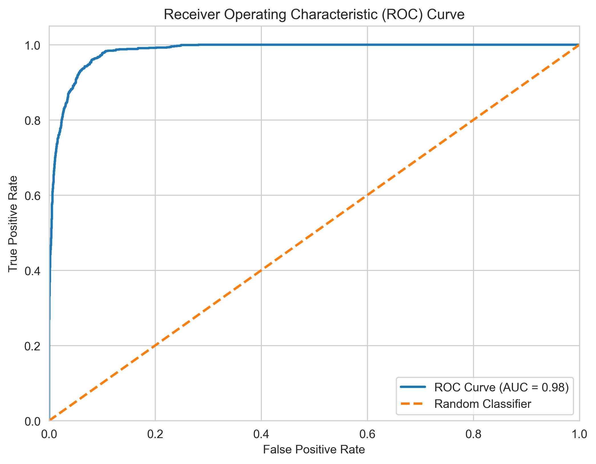

The feature coefficients of the Logistic Regression model were also analyzed to understand the relative influence of the selected features on default prediction.

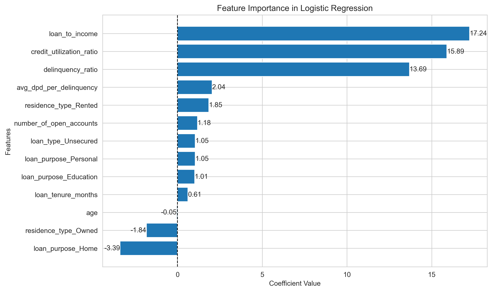

### 11.11 Final Model Selection

The nine modelling experiments were compared based on **Precision, Recall, and F1-Score**, with the primary objective of achieving **more than 90% recall and more than 50% precision for the default class**.

**Experiment 8 — Logistic Regression with SMOTE-Tomek and Optuna** was selected as the final model. It achieved **56% precision, 94% recall, and 70% F1-score** for the default class, satisfying the defined performance targets while providing the interpretability and probability estimation capabilities required for the credit risk application.

### 11.12 Streamlit Application

The final model was integrated into an interactive **Streamlit application** to provide a practical interface for credit risk assessment. Users can enter applicant, loan, and credit bureau information, after which the application performs the required feature engineering and preprocessing before generating the model prediction.

The application provides the **probability of loan default**, converts the probability into a **Credit Score ranging from 300 to 900**, and assigns a corresponding **Credit Rating** of **Poor, Average, Good, or Excellent**.

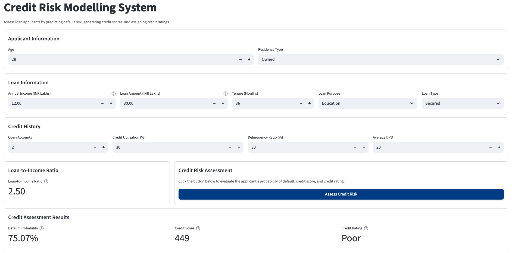

---

## 12. MLOps Implementation – Phase 2

Phase 2 focused on transforming the **Credit Risk Model developed in Phase 1** into a more structured and production-oriented machine learning system. The workflow introduced MLflow experiment tracking and model registry, centralized MLflow management using DagsHub, FastAPI model serving, API testing with Postman, cloud deployment using Render, and model monitoring using PSI and CSI.

The phase also includes the implementation of **CI/CD automation and automated model monitoring & alerting**, completing the transition from model development to an operational MLOps workflow.

### 12.1 MLflow – Experiment Tracking

MLflow was implemented to **track and compare nine different machine learning experiments** using the processed, model-ready data prepared from Phase 1. This allowed the experiments to focus directly on model training and evaluation without repeating the complete data preparation and feature selection workflow.

For each experiment, MLflow tracked the model's performance metrics, run information, and trained model artifact, allowing the experiments to be compared and the selected model to be retrieved later.

The experiments covered Logistic Regression and Random Forest models, hyperparameter optimization using RandomizedSearchCV and Optuna, and class imbalance handling using Random Under Sampling and SMOTE-Tomek.

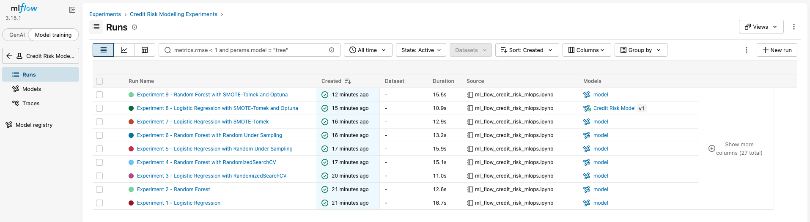

| Experiment | Model                                       | Accuracy | Precision (Default) | Recall (Default) | F1-Score (Default) |
| ---------- | ------------------------------------------- | -------: | ------------------: | ---------------: | -----------------: |
| 1          | Logistic Regression                         |     0.96 |                0.85 |             0.72 |               0.78 |
| 2          | Random Forest                               |     0.97 |                0.86 |             0.71 |               0.78 |
| 3          | Logistic Regression + RandomizedSearchCV    |     0.96 |                0.83 |             0.74 |               0.78 |
| 4          | Random Forest + RandomizedSearchCV          |     0.96 |                0.72 |             0.86 |               0.78 |
| 5          | Logistic Regression + Random Under Sampling |     0.92 |                0.51 |             0.95 |               0.67 |
| 6          | Random Forest + Random Under Sampling       |     0.92 |                0.53 |             0.97 |               0.68 |
| 7          | Logistic Regression + SMOTE-Tomek           |     0.93 |                0.55 |             0.94 |               0.70 |
| 8          | Logistic Regression + SMOTE-Tomek + Optuna  |     0.93 |                0.56 |             0.94 |               0.70 |
| 9          | Random Forest + SMOTE-Tomek + Optuna        |     0.96 |                0.70 |             0.88 |               0.78 |

Based on the required target of **more than 90% recall and more than 50% precision for the default class**, **Experiment 8 — Logistic Regression with SMOTE-Tomek and Optuna** was selected as the final model. It achieved **94% recall and 56% precision**, satisfying both targets. Although Experiment 9 achieved higher precision and F1-score, its **88% recall** was below the required target.

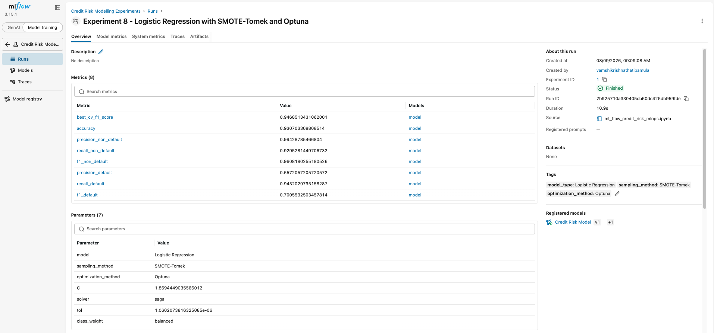

### 12.2 MLflow – Model Registry

After completing experiment tracking, the best-performing model from **Experiment 8 — Logistic Regression with SMOTE-Tomek and Optuna** was registered in the MLflow Model Registry under the name **Credit Risk Model** as **Version 1**.

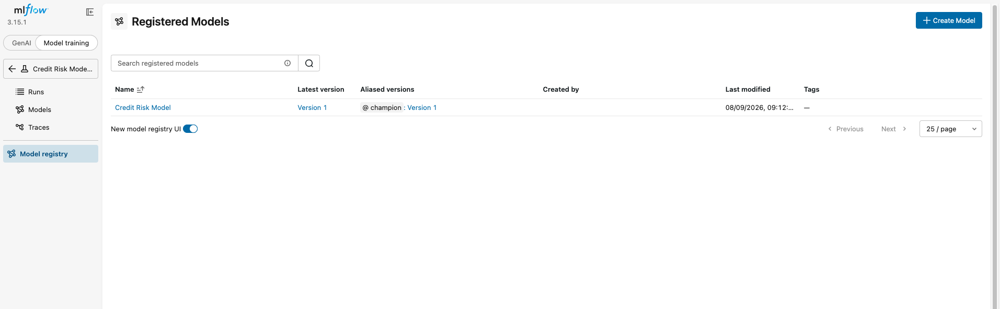

The registered model was loaded directly from the Model Registry and evaluated on the test dataset to verify that its predictions were consistent with the original Experiment 8 model. The registered model achieved **93% overall accuracy**, with **56% precision, 94% recall, and 70% F1-score for the default class**, confirming that the registered model maintained its expected performance.

Version 1 was then assigned the **`champion` alias**, identifying it as the current model selected for deployment. This alias-based approach allows future model versions to replace the current champion without requiring changes to the model-serving application.

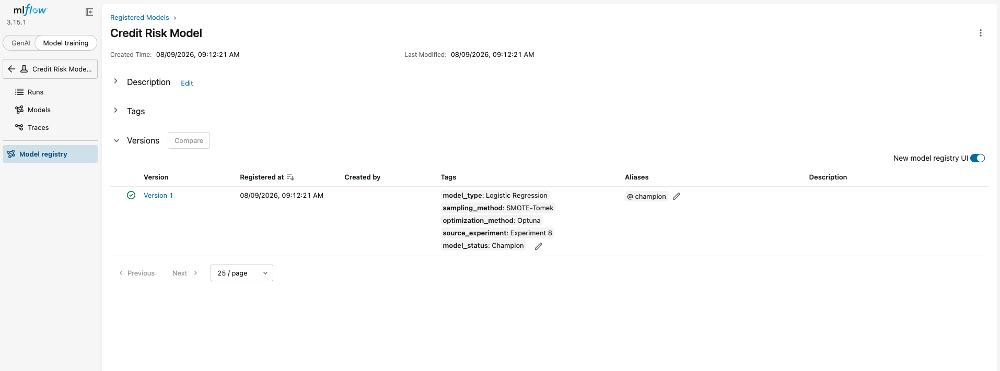

Descriptive metadata was also added to the model version, including the **model type, sampling method, optimization method, source experiment, and model status**, making the registered model easier to identify and manage.

### 12.3 Centralized MLflow Server using DagsHub

The local MLflow setup was migrated to a **centralized MLflow environment using DagsHub**, allowing experiment tracking and model management to be accessed remotely rather than being limited to the local development environment.

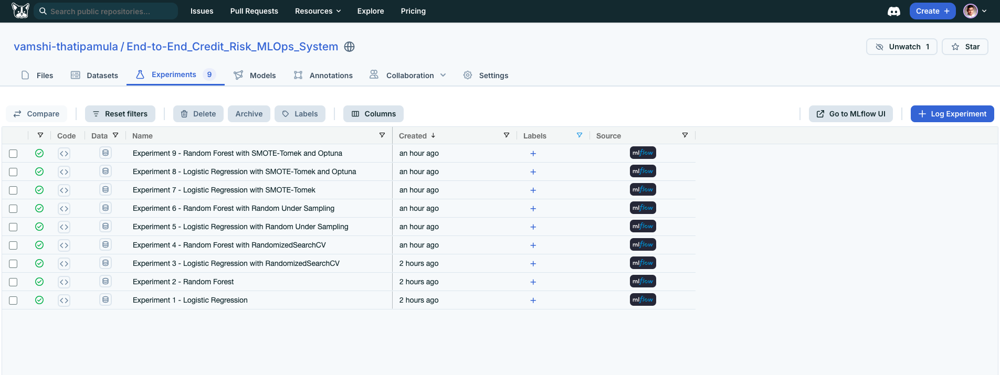

The **Credit Risk Modelling Experiments** experiment was configured on the DagsHub-hosted MLflow server, where all **9 machine learning experiments** were tracked with their corresponding metrics and model artifacts. **Experiment 8 — Logistic Regression with SMOTE-Tomek and Optuna** was identified as the selected model, and its logged model was registered in the centralized Model Registry as **Credit Risk Model – Version 1**.

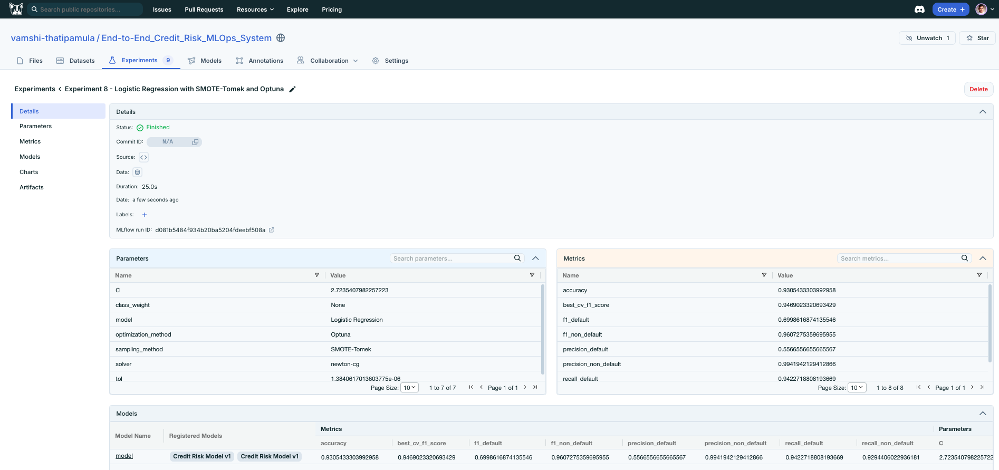

The registered model was successfully retrieved from the centralized Model Registry and validated against the test dataset to confirm that its predictive performance remained consistent. **Version 1 was then assigned the `champion` alias**, identifying it as the current model for deployment.

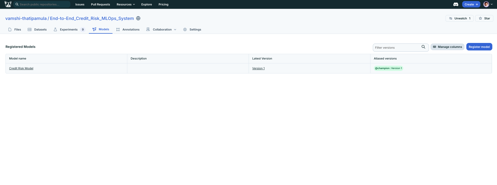

This centralized setup established a remote workflow for **experiment tracking, model management, model registration, versioning, alias management, and model validation**, while making the MLflow resources accessible independently of the local development environment.

### 12.4 FastAPI Model Serving

A **FastAPI-based model-serving application** was developed to serve the Credit Risk Model for real-time prediction. The FastAPI application was maintained separately from the Streamlit application to keep the model-serving layer independent.

The application was integrated with the **DagsHub-hosted MLflow Model Registry** and configured to load the **Credit Risk Model using the `champion` alias**. This ensures that the application uses the currently designated production model rather than depending on a hardcoded local model file.

The original prediction pipeline from Phase 1 was preserved during serving. The application performs **Loan-to-Income (LTI) feature engineering, One-Hot Encoding, numerical feature scaling, and feature-order alignment** before passing the processed input to the Logistic Regression model. The required preprocessing artifacts were retained to ensure that inference follows the same transformations used during model development.

A **Pydantic request schema** was implemented to validate applicant information before prediction. The application provides three endpoints:

* **GET `/`** — Confirms that the Credit Risk Modelling API is running.
* **GET `/health`** — Checks the API health and identifies the active Champion model.
* **POST `/predict`** — Accepts applicant information and returns the **default probability, credit score, and credit rating**.

The application was successfully run locally using **Uvicorn** and tested through FastAPI's **Swagger UI**. The `/predict` endpoint successfully retrieved the Champion model from DagsHub/MLflow, processed the applicant information, and generated the expected credit-risk assessment.

### 12.5 API Testing with Postman

The FastAPI model-serving application was tested using **Postman** to verify both successful prediction requests and input-validation behavior. The `/health` endpoint was first tested to confirm that the API was running correctly and connected to the **Credit Risk Model using the `champion` alias** from the DagsHub MLflow Model Registry.

The `/predict` endpoint was then tested with a valid applicant request containing the required credit, loan, and applicant information. The API successfully processed the request and returned the **default probability, credit score, and credit rating** with an **HTTP 200 OK** response.

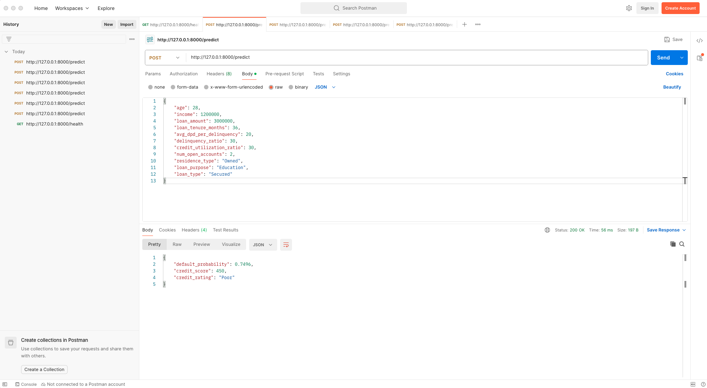

Additional validation testing was performed using invalid requests. An applicant with an age below the permitted minimum was correctly rejected, while a request with a missing required field also returned a FastAPI validation error. The valid request was subsequently restored and executed successfully.

This testing confirmed that the model-serving application can **process valid prediction requests, validate incoming inputs, reject invalid requests, and return structured prediction responses** before proceeding to cloud deployment.

### 12.6 Cloud Deployment of FastAPI Model-Serving Application using Render

The **Credit Risk Model** was deployed as a cloud-based **FastAPI model-serving application on Render**, making the model accessible outside the local development environment.

The FastAPI application was maintained as a dedicated model-serving component containing `main.py`, `prediction_helper.py`, the required preprocessing artifacts, and `requirements.txt`. The application was first tested locally to verify the prediction pipeline before deployment.

The application was deployed from the project's **GitHub repository**, with sensitive and environment-specific files excluded through `.gitignore`. The Render deployment was configured using the `main` **branch**, Python runtime, the project root as the working directory, and `pip install -r requirements.txt` as the build command.

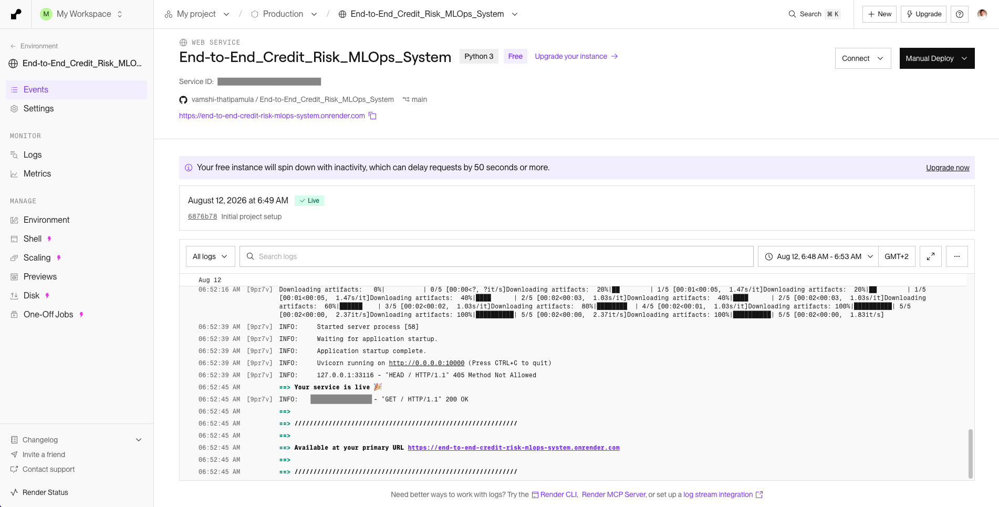

Since the application retrieves the **Champion Credit Risk Model from DagsHub/MLflow**, the required DagsHub and MLflow credentials were configured as **Render environment variables** rather than being stored in the source code. This keeps sensitive credentials separate from the public repository.

The deployed application provides the following endpoints:

* **GET `/`** — Confirms that the application is running.
* **GET `/health`** — Checks the health and availability of the model-serving application.
* **POST `/predict`** — Accepts applicant information and returns the **default probability, credit score, and credit rating**.

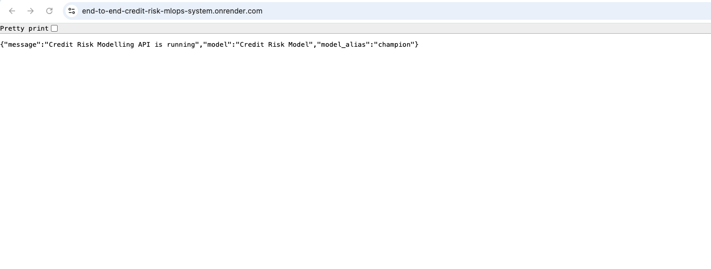

After deployment, the public application URL was accessed successfully and the / and /health endpoints returned their expected responses, confirming that the Credit Risk Model was successfully deployed as a cloud-based FastAPI model-serving application on Render, with secure access to the Champion model through DagsHub/MLflow.

> **Note:** The FastAPI model-serving application was deployed on Render for learning and portfolio demonstration purposes. The deployment was intended to demonstrate the practical implementation of cloud-based model serving rather than represent a production deployment for a real insurance or financial institution.

### 12.7 Testing the Deployed API using Postman

The **deployed FastAPI application** was tested using **Postman** to verify that the production `/predict` endpoint could successfully process applicant information and return the expected credit risk prediction.

A **POST request** was sent to the deployed Render `/predict` endpoint with a raw JSON request body containing the required applicant, loan, and credit-related attributes. The request was successfully processed by the cloud-hosted application, which returned the **default probability, credit score, and credit rating**.

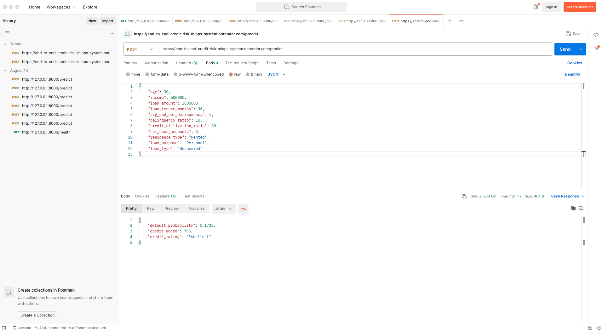

The successful response confirmed that the **cloud-deployed Credit Risk Model** could accept real-time applicant information and generate the expected prediction through the deployed FastAPI application.

### 12.8 Drift Detection using PSI & CSI

Model monitoring was implemented using **Population Stability Index (PSI)** and **Characteristic Stability Index (CSI)** to detect distributional changes in model predictions and input features.

For **PSI**, model prediction probabilities were compared across defined probability bins to measure changes in the overall prediction distribution. The PSI contribution of each probability range was also analyzed to identify the ranges contributing most to the observed shift.

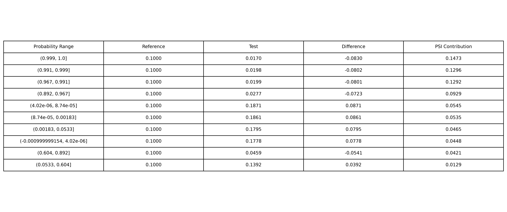

For **CSI**, distributional changes were evaluated across the **10 model features**. For numerical features, direct category-level comparison was used for features with fewer unique values, while continuous features were grouped into bins before calculating CSI.

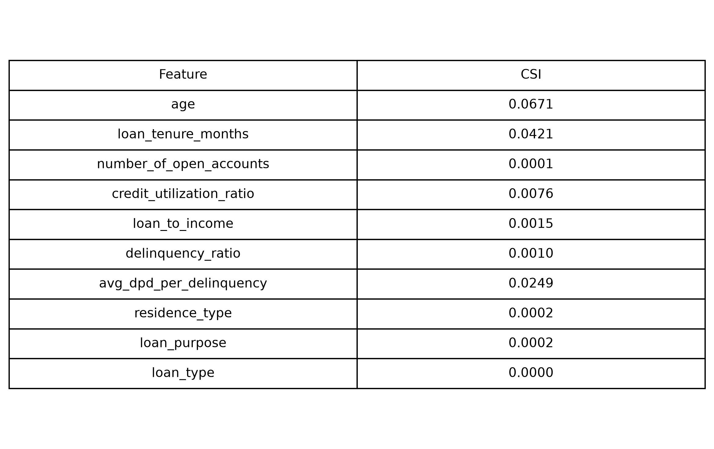

The analysis resulted in a **PSI of 0.7537**, indicating a significant shift in the model prediction distribution. In contrast, **all 10 features had CSI values below 0.1**, indicating relatively stable feature distributions despite the substantial shift observed in the model prediction probabilities.

> **Note:** The reference and test data used for the PSI and CSI analysis were provided as part of the course/project materials and are not included in this repository. The test data used for this drift analysis was not directly collected from the deployed Render application. Therefore, the PSI and CSI results demonstrate the implementation and interpretation of model monitoring techniques rather than representing actual production drift from the deployed application.

### 12.9 CI/CD Pipeline

### 12.10 Automated Model Monitoring & Alerting

---

## 13. Results

The project successfully progressed from **credit risk model development in Phase 1** to **MLOps implementation in Phase 2**, establishing an end-to-end workflow for developing, evaluating, managing, serving, and monitoring the Credit Risk Model.

### 13.1 Phase 1 – Credit Risk Model Development

The final **Optuna-optimized Logistic Regression model with SMOTE-Tomek** was selected after evaluating nine modelling experiments. For the default class, the model achieved:

* **Precision:** 56%
* **Recall:** 94%
* **F1-Score:** 70%
* **ROC-AUC:** 0.98
* **KS Statistic:** 85.99
* **Gini Coefficient:** 0.97

The model satisfied the defined performance requirements of **more than 90% recall and more than 50% precision** for the default class.

### 13.2 Phase 2 – MLOps Implementation

The selected model was registered and managed using **MLflow**, with **DagsHub** providing centralized experiment tracking and model registry capabilities. The model was versioned as **Credit Risk Model – Version 1** and assigned the **`champion` alias** for deployment.

A **FastAPI model-serving application** was developed to retrieve the Champion model from the centralized MLflow Model Registry and provide real-time credit risk predictions through API endpoints. The application was tested locally and through **Postman**, then successfully deployed to **Render**.

For model monitoring, **PSI** and **CSI** were implemented to identify distributional changes after deployment. The analysis produced a **PSI of 0.7537**, indicating a significant shift in the model prediction distribution, while **all 10 features recorded CSI values below 0.1**, indicating relatively stable feature distributions.

Overall, the project established an end-to-end **credit risk modelling and MLOps workflow**, covering model development, experimentation, model registry, centralized model management, API-based serving, cloud deployment, and model monitoring.

---

## 14. Key Takeaways

* Developed a complete **credit risk classification model** using customer, loan, and credit bureau data.
* Applied a structured modelling workflow covering **data leakage prevention, data cleaning, EDA, feature engineering, WoE & IV-based feature selection, class imbalance handling, and hyperparameter optimization**.
* Evaluated **nine modelling experiments** and selected the **Optuna-optimized Logistic Regression with SMOTE-Tomek** based on the defined precision and recall requirements.
* Evaluated the final model using both **standard classification metrics** and **credit risk-specific metrics**, achieving strong discriminatory and ranking performance.
* Implemented **MLflow experiment tracking and model registry**, with **DagsHub** providing a centralized environment for experiment and model management.
* Established model versioning through the **Champion alias**, creating a clear mechanism for identifying the model selected for deployment.
* Developed a **FastAPI model-serving application** that retrieves the Champion model and generates **default probability, credit score, and credit rating**.
* Tested the model-serving application using **Postman** and successfully deployed it to **Render**.
* Implemented **PSI and CSI-based model monitoring** to assess changes in prediction and feature distributions after deployment.
* Established an end-to-end workflow connecting **machine learning model development with model management, serving, deployment, and monitoring**.

---

## 15. Skills Demonstrated

* **Python Programming** — Developed the complete machine learning and MLOps workflow using Python.
* **Data Processing & Analysis** — Used Pandas and NumPy for data preparation, validation, transformation, and analysis.
* **Exploratory Data Analysis** — Analyzed feature distributions and relationships using Matplotlib, Seaborn, box plots, histograms, and KDE plots.
* **Feature Engineering** — Created LTI Ratio, Delinquency Ratio, and Average DPD per Delinquency, along with feature selection using WoE, Information Value, and VIF.
* **Machine Learning** — Developed and evaluated Logistic Regression and Random Forest classification models using Scikit-learn.
* **Class Imbalance Handling** — Applied Random Under Sampling and SMOTE-Tomek to improve minority-class detection.
* **Hyperparameter Optimization** — Used RandomizedSearchCV and Optuna for model optimization.
* **Credit Risk Model Evaluation** — Applied Precision, Recall, F1-Score, ROC-AUC, ROC Curve, KS Statistic, Gini Coefficient, and Decile Analysis.
* **MLflow & Model Management** — Implemented experiment tracking, model registration, model versioning, and Champion alias management.
* **DagsHub** — Configured centralized MLflow tracking and model management using DagsHub.
* **FastAPI Model Serving** — Developed API endpoints for real-time credit risk prediction with Pydantic-based request validation.
* **API Testing** — Tested API functionality and validation scenarios using Postman.
* **Cloud Deployment** — Deployed the FastAPI model-serving application on Render.
* **Model Monitoring** — Implemented PSI and CSI to identify changes in prediction and feature distributions.
* **Streamlit Application Development** — Integrated the final model into an interactive credit risk prediction dashboard.
* **Version Control & Project Management** — Used Git and GitHub to manage and organize the project codebase and documentation.

---

## 16. How to Run the Project

### 16.1 Clone the Repository

Clone this repository to your local machine.

### 16.2 Install the Required Dependencies

```bash
pip install -r requirements.txt
```

### 16.3 Launch the Streamlit Application

```bash
streamlit run app/main.py
```

### 16.4 Access the Application

Once the Streamlit application starts successfully, it will be available in your web browser, allowing users to perform real-time credit risk assessment by entering customer, loan, and bureau information. The application predicts the probability of loan default, generates a Credit Score (300–900), and assigns a corresponding Credit Rating.

### 16.5 Run the FastAPI Application

```bash
uvicorn fastapi_app.main:app --reload
```

### 16.6 Test the FastAPI Application Locally

Before cloud deployment, the FastAPI application was tested locally using Postman to verify the /health and /predict endpoints, including both valid and invalid requests.

### 16.7 Cloud Deployment and Post-Deployment Testing

The FastAPI model-serving application was deployed to Render and the deployed endpoints were subsequently tested using Postman to verify that the cloud-hosted application could successfully retrieve the Champion model and generate credit risk predictions.

---

## 17. Future Improvements

Although the project successfully demonstrates an end-to-end **credit risk modelling and MLOps workflow**, the following improvements could be explored in future iterations:

* **Automated Model Retraining** — Develop a workflow to retrain the model when sufficient new data becomes available or when model performance shows signs of degradation.

* **Enhanced Model Monitoring** — Extend the existing PSI and CSI analysis with additional monitoring metrics to provide a more comprehensive view of model behaviour over time.

* **Model Performance Tracking** — Periodically evaluate the model using labelled data to monitor its predictive performance and identify any signs of performance degradation.

---

## 18. Final Conclusion

This project provided an end-to-end implementation of a **Credit Risk Modelling System**, covering the complete journey from data preparation and exploratory analysis to model development, evaluation, application development, and MLOps implementation.

The project involved developing and selecting a Logistic Regression model using **SMOTE-Tomek and Optuna**, with the final model achieving **56% precision, 94% recall, and 70% F1-score for the default class**, meeting the defined modelling objectives. Credit-risk-specific evaluation using **ROC-AUC, KS, and Gini** further demonstrated the model's strong discriminatory and ranking capability.

The MLOps phase extended the project beyond model development through **MLflow experiment tracking and model registry, centralized model management using DagsHub, FastAPI model serving, Postman testing, Render deployment, and PSI/CSI-based model monitoring**. The project also established the foundation for CI/CD automation and automated model monitoring and alerting.

Overall, the project demonstrates a **complete machine learning and MLOps workflow**, bringing together model development, evaluation, experiment tracking, model management, API-based model serving, cloud deployment, and model monitoring within a single system.


